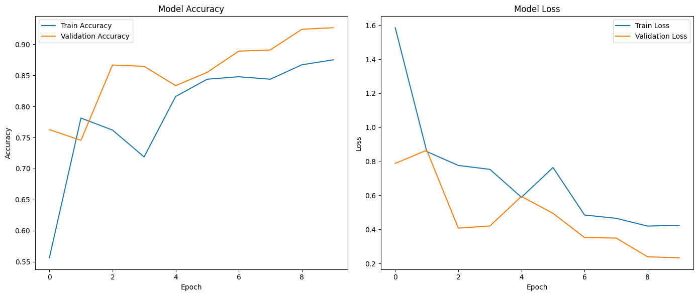
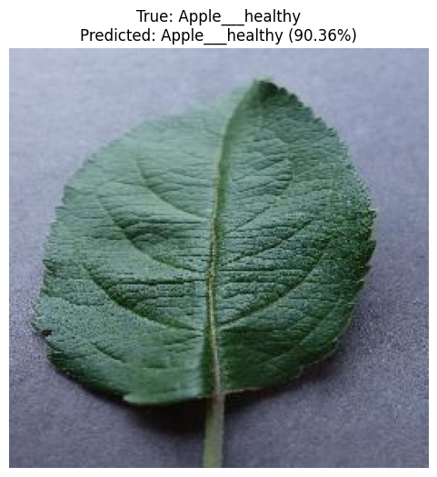

# Ургамлын Өвчин Ангилах Convolutional Neural Network

Convolutional Neural Network (CNN) ашиглан ургамлын өвчнийг ангилах гүн сурах төсөл. TensorFlow болон Keras ашигласан.

## Товч танилцуулга

Энэхүү төсөл нь PlantVillage өгөгдлийн багцыг ашиглан навчны зургаас ургамлын янз бүрийн өвчнийг ангилах CNN загвар юм. Загвар нь scratch-аас нь сургагдсан бөгөөд олон төрлийн ургамлын өвчний төрлүүдийг таних чадвартай.

## Онцлог шинж чанарууд

- 3 конволюшин давхаргатай тусгай CNN архитектур
- Загварын ерөнхий чанарыг сайжруулах өгөгдлийн нэмэгдүүлэлт
- Сургалтын явцад автомат checkpoint хадгалалт
- Нарийвчлал болон алдааны график дүрслэл

## Өгөгдлийн багц

Төсөл нь Kaggle-ээс авах боломжтой [PlantVillage өгөгдлийн багц](https://www.kaggle.com/datasets/mohitsingh1804/plantvillage)-ыг ашигласан. Энэ нь эрүүл болон өвчтэй ургамлын навчны зургуудыг агуулдаг.

1. **Өгөгдлийн бүтэц**
   ```
   PlantVillage/
   ├── train/
   │   ├── анги_1/
   │   ├── анги_2/
   │   └── ...
   └── val/
       ├── анги_1/
       ├── анги_2/
       └── ...
   ```

## Загварын архитектур

```
Conv2D (32 шүүлтүүр, 3x3) → ReLU → MaxPooling (2x2)
Conv2D (64 шүүлтүүр, 3x3) → ReLU → MaxPooling (2x2)
Conv2D (128 шүүлтүүр, 3x3) → ReLU → MaxPooling (2x2)
Flatten (Хавтгайруулах)
Dense (512 нэгж) → ReLU → Dropout (0.5)
Dense (АНГИЛЛЫН_ТОО) → Softmax
```

## Тохиргооны параметрүүд

| Параметр | Үндсэн утга | Тайлбар |
|----------|-------------|---------|
| IMG_WIDTH | 256 | Оролтын зургийн өргөн |
| IMG_HEIGHT | 256 | Оролтын зургийн өндөр |
| BATCH_SIZE | 32 | Нэг алхамд сургах өгөгдлийн багцын хэмжээ|
| EPOCHS | 10 | Сургалтын үечлэлийн тоо |
| LEARNING_RATE | 0.001 | Adam оновчлогчийн суралцах хурд|

## Data augmentation

Пикселийн утгыг 0–1 мужид нормалчилсон
Зургийг ±20° хүртэл санамсаргүй байдлаар эргүүлсэн
0.8×–1.2× хэмжээний санамсаргүй байдлаар масштабын өөрчлөлт хийсэн
Хэвтээ тэнхлэгээр mirror урвуулалт ашигласан
Padding хийхдээ тогтмол дүүргэлтийн стратеги хэрэглэсэн

Энэхүү ажилд ашигласан судалгаа:
**"Deep Learning for Plant Disease Detection and Classification: A Systematic Analysis and Review"**  
Зохиогчид: Pranajit Kumar Das, Subarna Sarker Rupa, Suree Pumrin, Utpal Chandra Das, Md. Khalid Hossen  

Үр дүн




